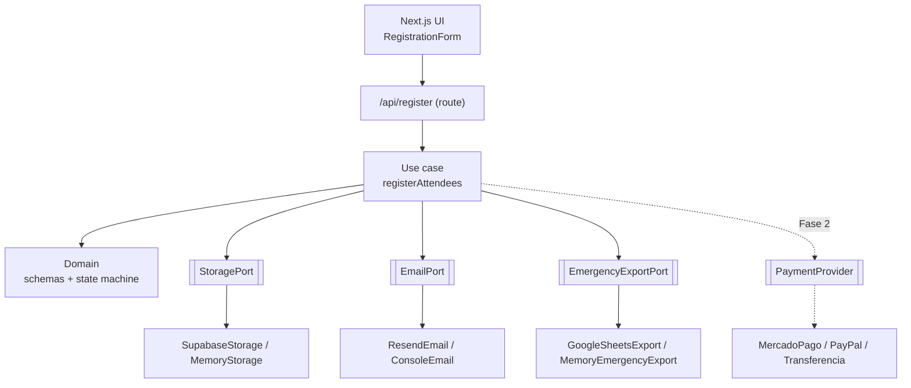
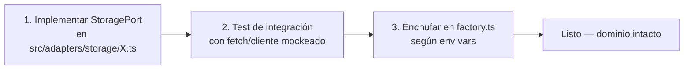

# Arquitectura

Arquitectura **hexagonal (ports & adapters)**. La lógica de negocio vive en
`src/core` sin ninguna dependencia de Next, React ni SDKs externos. Todo lo
de afuera (base de datos, email, planilla, pagos) se conecta por **puertos**
(interfaces) implementados por **adapters** intercambiables.

Esto cumple dos objetivos del proyecto:

1. **Portabilidad**: mover el proyecto a otro repo = copiar `src/core` + `docs`
   y reconectar adapters.
2. **Cambiar de proveedor** (ej: Mercado Pago → otro): solo se escribe un
   adapter nuevo y se enchufa en `src/adapters/factory.ts`. El dominio no se
   toca.

## Capas

| Carpeta | Rol | Depende de |
|---|---|---|
| `src/core/domain` | Entidades, validación (zod), máquina de estados, errores | nada |
| `src/core/ports` | Interfaces de servicios externos | `domain` |
| `src/core/usecases` | Orquestación del negocio | `domain`, `ports` |
| `src/adapters` | Implementaciones concretas de los ports | `core` |
| `src/app` | Next: UI + API routes (capa fina) | `core`, `adapters` |

**Regla de oro:** `src/core/**` nunca importa de `src/adapters` ni de `next`.
Si necesitás un servicio externo desde el dominio, definí un puerto.

## Cómo agregar un adapter nuevo (ej: cambiar el storage)

Los adapters externos reciben un `fetch` inyectable (default: el global), así
los tests de integración los ejercitan sin red ni credenciales reales.

## Selección de adapter (factory)

`src/adapters/factory.ts` elige el adapter según variables de entorno. Sin
credenciales, cae en los adapters de desarrollo (memoria / consola), así la
app corre local y en E2E sin servicios reales.
