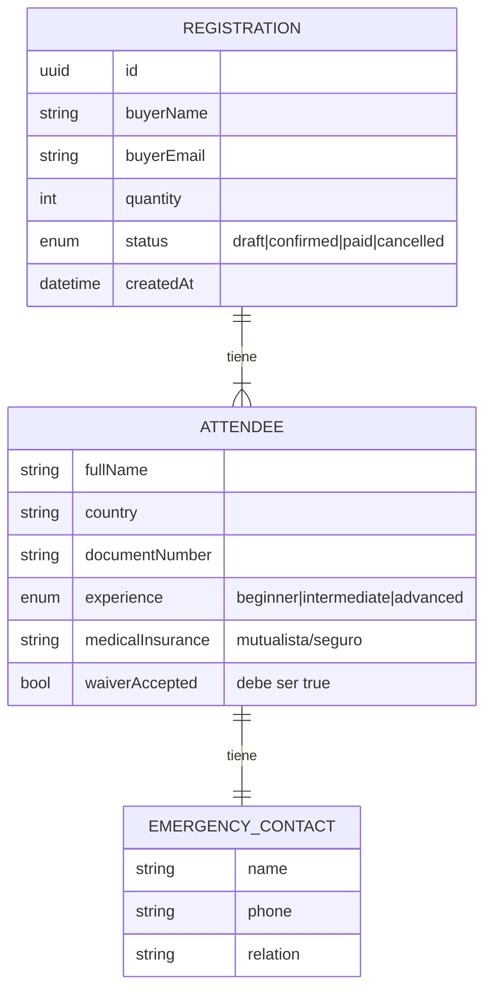

# Modelo de datos

Tipos canónicos en `src/core/domain/types.ts`. Validación en
`src/core/domain/schemas.ts` (zod).

## Persistencia (Fase 1)

El adapter `SupabaseStorage` guarda **una fila por registración** con los
asistentes en una columna **JSONB `attendees`**. Es lo más simple para el
volumen del evento; normalizar a una tabla `attendees` aparte queda como
opción futura si se necesitan queries por asistente.

| Columna | Tipo |
|---|---|
| `id` | uuid (pk) |
| `buyer_name` | text |
| `buyer_email` | text |
| `quantity` | int |
| `attendees` | jsonb |
| `status` | text |
| `created_at` | timestamptz |

## Reglas de validación clave

- **Deslinde obligatorio:** `waiverAccepted` debe ser `true` (`z.literal(true)`);
  el texto lo provee ASU, acá solo guardamos el flag + un link.
- **Cantidad coherente:** `attendees.length === quantity`.
- **Email válido**, todos los campos de texto no vacíos (trim).

## Privacidad (Ley 18.331 UY)

Se recolectan **datos sensibles** (documento, contacto de emergencia,
mutualista/seguro). Implicancias:

- Supabase con **Row Level Security**; nada de tablas públicas.
- La planilla de emergencia es **read-only** y de acceso restringido a
  organizadores (ver [emergency-access.md](./emergency-access.md)).
- No exponer `SUPABASE_SERVICE_KEY` al cliente (solo server-side).
