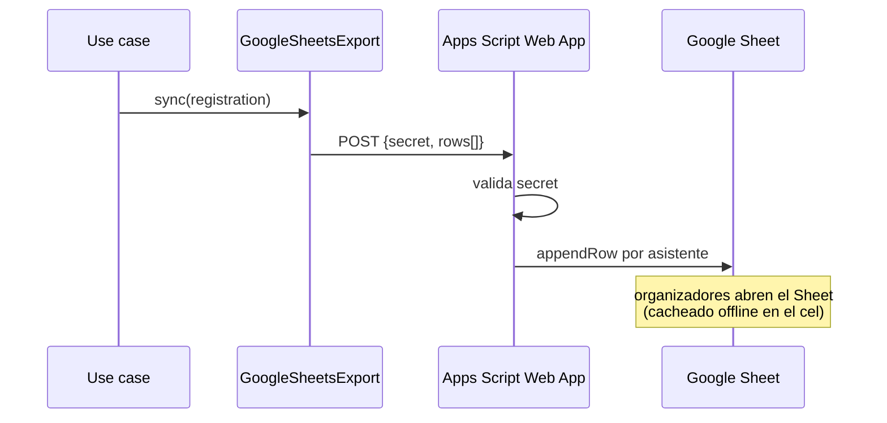

# Acceso de emergencia a los datos

En el spot de highline puede **no haber señal**. Los organizadores necesitan
ver documento, contacto de emergencia y mutualista de cada asistente sin
consultar la base de datos.

**Solución:** Supabase = fuente de verdad. Cada registro confirmado se copia
automáticamente a un **Google Sheet read-only**. Google Sheets **cachea
offline** en el celular, así la lista queda disponible sin conexión.

## Cómo se conecta (Apps Script)

Delegamos la autenticación de Google a un **Web App de Google Apps Script**
ligado a la planilla. El adapter solo hace un POST con un `secret` compartido;
el script valida y agrega filas. Así evitamos manejar OAuth/JWT de Google en
la app.

1. Crear el Google Sheet de emergencia.
2. Extensiones → Apps Script: un `doPost(e)` que valide `secret` y haga
   `appendRow` por cada fila recibida.
3. Publicar como Web App. Copiar la URL a `SHEETS_WEBHOOK_URL` y el token a
   `SHEETS_WEBHOOK_SECRET`.

Cada asistente se aplana a una fila (ver `toEmergencyRows` en
`src/adapters/emergency/google-sheets-export.ts`):

| Campo | |
|---|---|
| registrationId, buyerName, buyerEmail | identificación |
| attendeeName, country, documentNumber, experience | asistente |
| emergencyContact{Name,Phone,Relation} | a quién llamar |
| medicalInsurance | mutualista / seguro |

## Antes del evento

- Abrir el Sheet en el cel de cada organizador para que **quede cacheado offline**.
- Mantener el Sheet **read-only** y restringido (datos sensibles, Ley 18.331).
