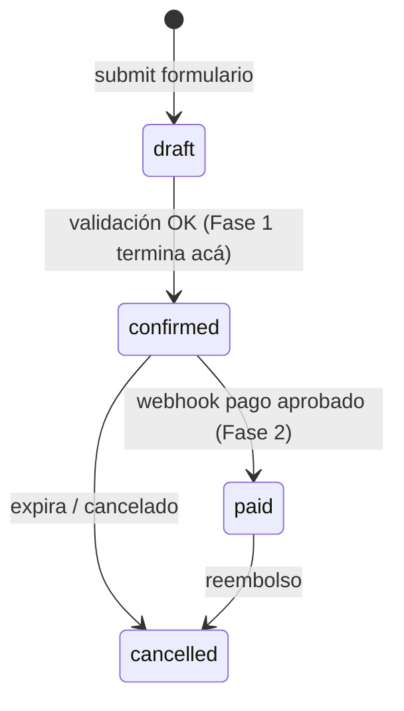
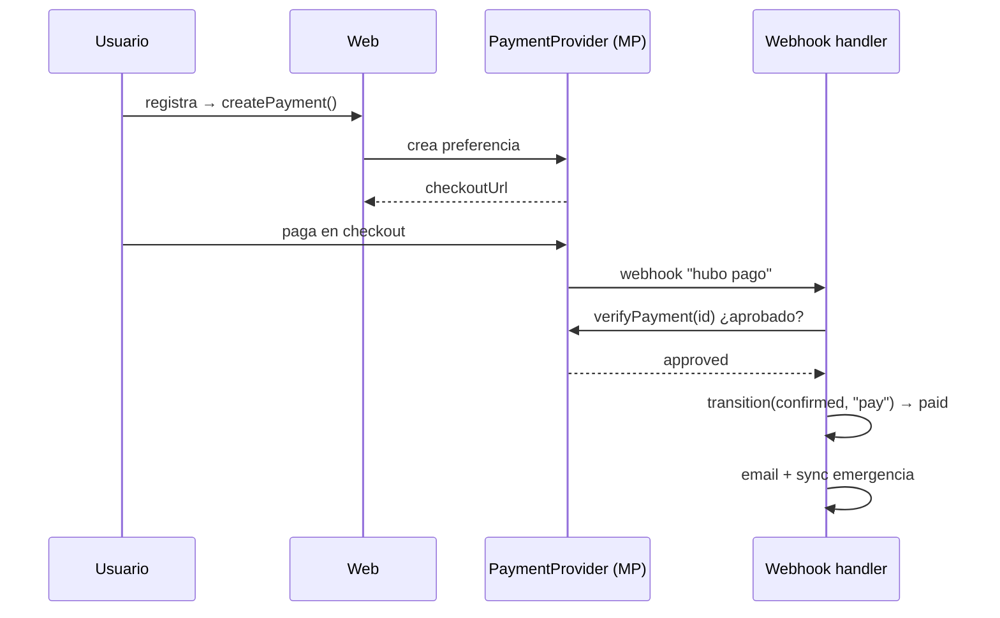
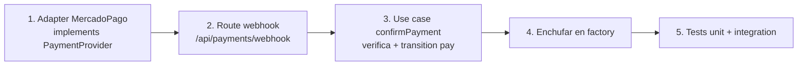

# Flujo de pago (Fase 2 — diseño)

> **Estado:** esqueleto implementado (ver `docs/dev-memory/0002`). Funciona
> end-to-end con adapters dev / `fetch` mockeado; **falta enchufar credenciales
> reales de Mercado Pago** y la facturación DGI. El monto se calcula server-side
> (`src/core/domain/pricing.ts`); el webhook valida firma y verifica contra la
> API antes de confirmar.

## Por qué Mercado Pago (y no una tiquetera)

Necesitamos la plata **antes** del evento (remeras, gastos fijos). Las
tiqueteras pagan después del evento. Mercado Pago acredita al momento de la
venta y cubre bien Uruguay + región.

- **Fuera de LATAM:** link de PayPal manual para los pocos casos.
- **Transferencia bancaria:** adapter de **confirmación manual** (sin webhook).

## Máquina de estados

Implementada en `src/core/domain/state-machine.ts`. Fase 1 usa `confirm`;
`pay`/`refund` quedan listos para Fase 2.

## Regla de oro del pago

La confirmación real la da el proveedor por **webhook**, verificada contra su
API. **Nunca** se confía en el redirect de "gracias" del navegador.

## Pasos para implementar Fase 2

Pasos 1-5: **hechos a nivel esqueleto** (`docs/dev-memory/0002`). Además:
`startPayment` + `POST /api/payments` para iniciar, y `pricing.ts` para el monto.

Pendiente para cobrar de verdad:

- Credenciales **TEST** de Mercado Pago en `.env.local` / hosting (nunca en git
  ni en el chat). `MP_ACCESS_TOKEN` y `MP_WEBHOOK_SECRET` son secretos de
  servidor; nunca `NEXT_PUBLIC_`.
- Configurar el webhook en el panel de MP apuntando a una **URL pública HTTPS**
  estable (`/api/payments/webhook`). Un túnel/CDN sobre un server local sirve
  para sandbox; producción mejor en host siempre-encendido.
- `PRICING_CONFIG` real (tandas + precios por categoría) provista por ASU.
- **Facturación DGI** con contador (bloqueante no técnico).
