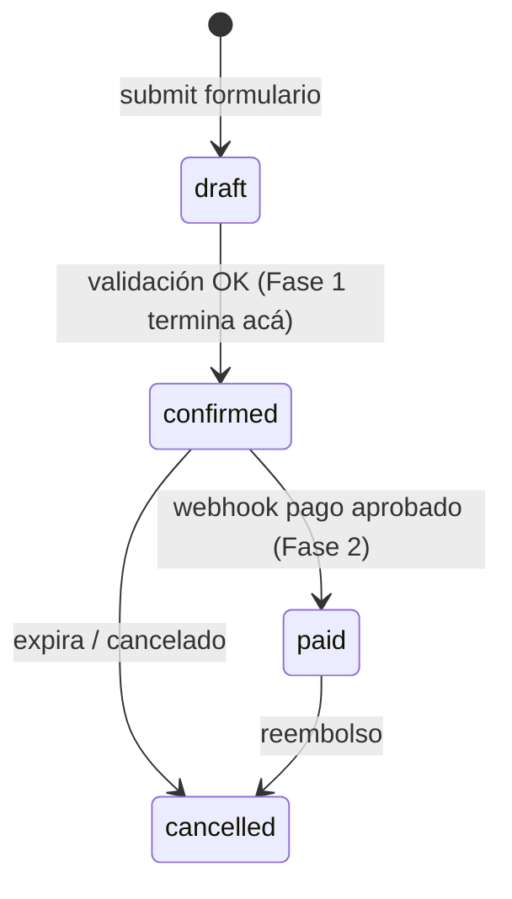
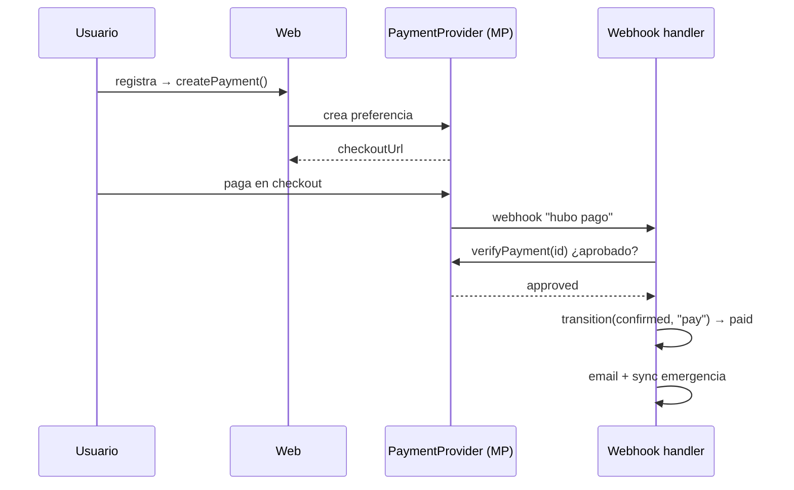
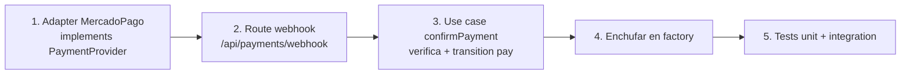

# Flujo de pago (Fase 2 — diseño)

> **Estado:** NO implementado. La interfaz `PaymentProvider` ya existe en
> `src/core/ports/payment.ts` para que el dominio quede listo sin acoplarse a
> Mercado Pago. Este doc describe cómo se enchufará.

## Por qué Mercado Pago (y no una tiquetera)

Necesitamos la plata **antes** del evento (remeras, gastos fijos). Las
tiqueteras pagan después del evento. Mercado Pago acredita al momento de la
venta y cubre bien Uruguay + región.

- **Fuera de LATAM:** link de PayPal manual para los pocos casos.
- **Transferencia bancaria:** adapter de **confirmación manual** (sin webhook).

## Máquina de estados

Implementada en `src/core/domain/state-machine.ts`. Fase 1 usa `confirm`;
`pay`/`refund` quedan listos para Fase 2.

## Regla de oro del pago

La confirmación real la da el proveedor por **webhook**, verificada contra su
API. **Nunca** se confía en el redirect de "gracias" del navegador.

## Pasos para implementar Fase 2

Bloqueantes externos (no técnicos): cuenta Mercado Pago, credenciales, y
**facturación DGI** con contador (ver README del plan).
