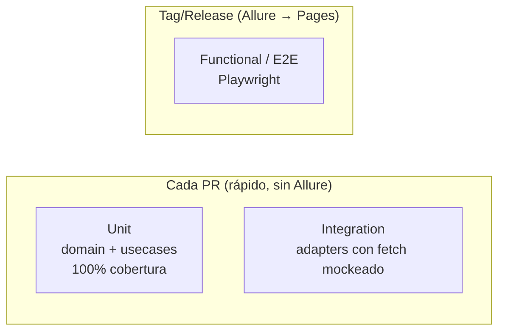

# Testing



## Qué se testea dónde

| Nivel | Qué | Dónde | Runner |
|---|---|---|---|
| Unit | dominio (zod, máquina de estados), use cases (ports mockeados) | `src/core/**/*.test.ts` | Vitest |
| Integration | adapters contra `fetch`/cliente mockeado | `tests/integration/**` | Vitest |
| E2E / funcional | flujo completo en el navegador | `tests/e2e/**` | Playwright + Allure |

## Cobertura

Gate de **100%** (statements/branches/functions/lines) sobre `src/core/**`
(la lógica de negocio portable). Configurado en `vitest.config.ts`. Los
puertos son interfaces puras → excluidos. La UI y los adapters no persiguen
100% (se cubren con integration + E2E).

## Comandos

```bash
npm test            # unit + integration (una vez)
npm run test:watch  # modo watch
npm run test:cov    # con cobertura + gate 100% core
npm run test:e2e    # Playwright (necesita navegadores instalados)
npm run typecheck   # tsc --noEmit
npm run lint        # eslint
```

## CI

- `.github/workflows/pr.yml` — en cada PR/push: lint + typecheck + `test:cov`.
  **Sin Allure** (rápido).
- `.github/workflows/release.yml` — en tag `v*`: E2E Playwright → reporte
  **Allure** → publica a **GitHub Pages**. Allure es **solo** para los tests
  funcionales/E2E, nunca para unit/integration.

## Notas

- Los adapters externos reciben un `fetch` inyectable → los tests de
  integración no usan red ni credenciales reales.
- En entornos donde Playwright no tiene navegador (ej: algunos WSL), el flujo
  igual se puede verificar levantando `npm run start` y haciendo `curl` a
  `POST /api/register`.
